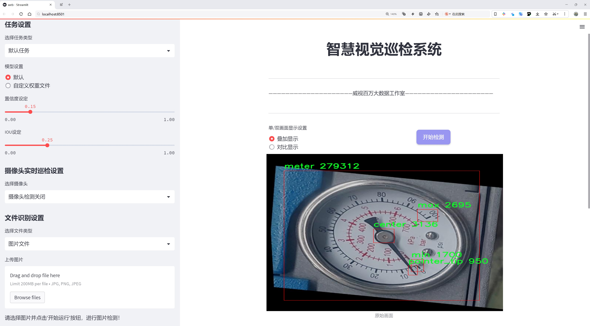
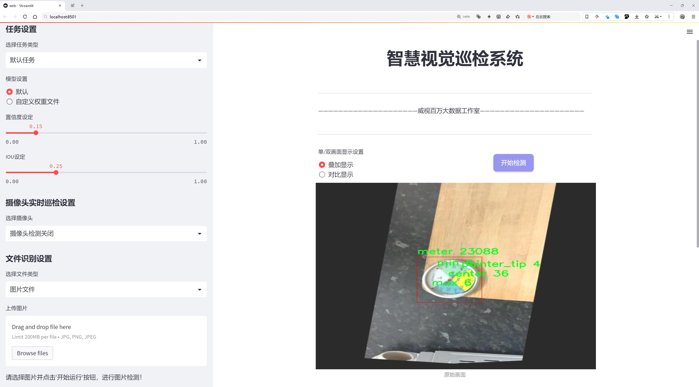
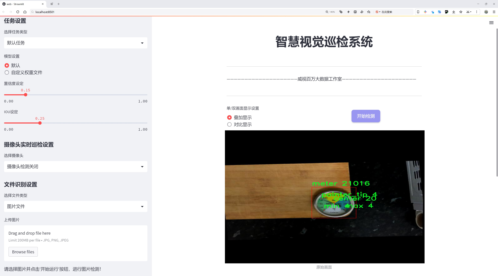
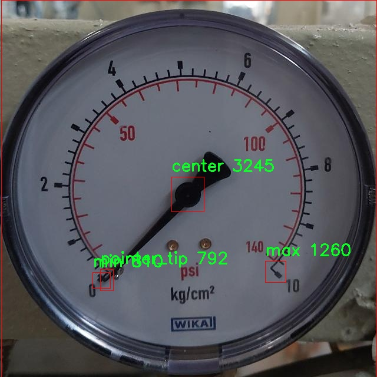
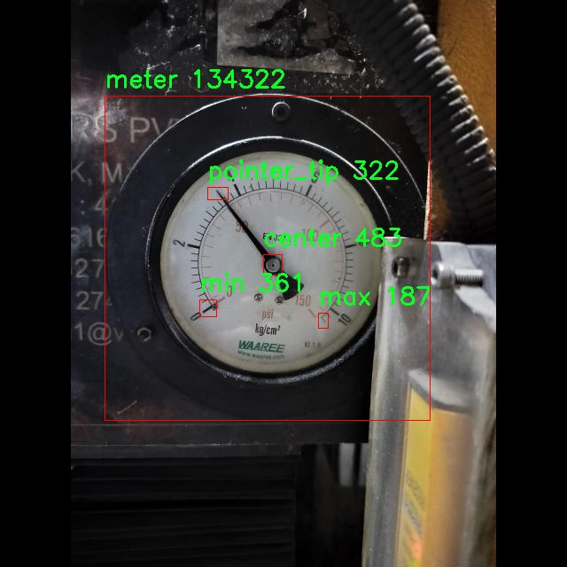
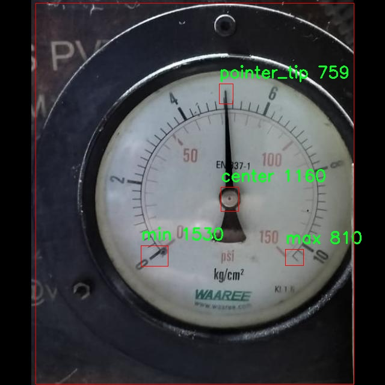
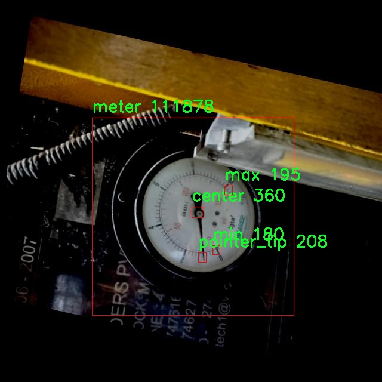
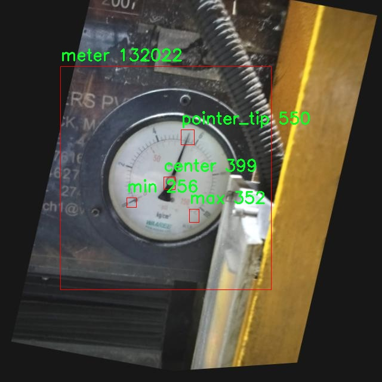

# 表盘针头位置检测检测系统源码分享
 # [一条龙教学YOLOV8标注好的数据集一键训练_70+全套改进创新点发刊_Web前端展示]

### 1.研究背景与意义

项目参考[AAAI Association for the Advancement of Artificial Intelligence](https://gitee.com/qunmasj/projects)

项目来源[AACV Association for the Advancement of Computer Vision](https://kdocs.cn/l/cszuIiCKVNis)

研究背景与意义

随着工业自动化和智能制造的快速发展，机器视觉技术在各个领域的应用愈发广泛，尤其是在精密仪器的检测与监控中。表盘仪器作为一种常见的测量工具，其准确性和可靠性直接影响到设备的性能和安全性。因此，如何高效、准确地检测表盘上的针头位置，成为了当前研究的一个重要课题。传统的针头位置检测方法多依赖于人工视觉或简单的图像处理技术，这些方法不仅效率低下，而且容易受到环境因素的影响，导致检测结果的不稳定性和准确性不足。

近年来，深度学习技术的迅猛发展为图像识别和目标检测提供了新的解决方案。YOLO（You Only Look Once）系列模型因其高效的实时检测能力和较高的准确率，已成为目标检测领域的热门选择。YOLOv8作为该系列的最新版本，进一步提升了模型的性能和适用性，尤其在小目标检测和复杂背景下的目标识别方面表现出色。然而，针对特定应用场景，如表盘针头位置检测，YOLOv8的标准模型可能无法完全满足需求，因此有必要对其进行改进和优化。

本研究旨在基于改进的YOLOv8模型，构建一个高效的表盘针头位置检测系统。为此，我们采用了一个包含1500张图像的数据集，该数据集涵盖了五个类别，包括针头的中心、最大值、最小值、表盘刻度和针尖。这些类别的设计不仅反映了表盘的基本构造，也为模型的训练提供了丰富的样本，确保了检测的全面性和准确性。通过对数据集的深入分析，我们可以更好地理解针头在不同状态下的表现，从而为模型的优化提供依据。

改进YOLOv8模型的意义在于，它不仅能够提高针头位置检测的准确性，还能显著提升检测速度，满足工业生产中对实时性的高要求。此外，借助深度学习技术，我们可以实现对复杂背景和不同光照条件下的针头检测，增强系统的鲁棒性。这一研究的成功实施，将为表盘仪器的自动化检测提供有力支持，推动相关领域的技术进步。

总之，基于改进YOLOv8的表盘针头位置检测系统的研究，不仅具有重要的理论意义，也具有广泛的应用前景。通过这一研究，我们期望能够为智能制造和工业自动化提供新的解决方案，提升生产效率和产品质量，推动相关技术的进一步发展。

### 2.图片演示







##### 注意：由于此博客编辑较早，上面“2.图片演示”和“3.视频演示”展示的系统图片或者视频可能为老版本，新版本在老版本的基础上升级如下：（实际效果以升级的新版本为准）

  （1）适配了YOLOV8的“目标检测”模型和“实例分割”模型，通过加载相应的权重（.pt）文件即可自适应加载模型。

  （2）支持“图片识别”、“视频识别”、“摄像头实时识别”三种识别模式。

  （3）支持“图片识别”、“视频识别”、“摄像头实时识别”三种识别结果保存导出，解决手动导出（容易卡顿出现爆内存）存在的问题，识别完自动保存结果并导出到tempDir中。

  （4）支持Web前端系统中的标题、背景图等自定义修改，后面提供修改教程。

  另外本项目提供训练的数据集和训练教程,暂不提供权重文件（best.pt）,需要您按照教程进行训练后实现图片演示和Web前端界面演示的效果。

### 3.视频演示

[3.1 视频演示](https://www.bilibili.com/video/BV1Vot6eNEnt/)

### 4.数据集信息展示

##### 4.1 本项目数据集详细数据（类别数＆类别名）

nc: 5
names: ['center', 'max', 'meter', 'min', 'pointer_tip']


##### 4.2 本项目数据集信息介绍

数据集信息展示

在本研究中，我们使用了名为“Needle Base Tip Min Max”的数据集，以支持改进YOLOv8模型在表盘针头位置检测系统中的应用。该数据集专门设计用于捕捉和标注表盘上针头的不同位置，具有重要的实际意义，尤其是在自动化检测和精确测量领域。数据集的构建旨在提供多样化的样本，以便模型能够学习到针头在不同状态下的特征，从而提高检测的准确性和鲁棒性。

“Needle Base Tip Min Max”数据集包含五个主要类别，分别为“center”、“max”、“meter”、“min”和“pointer_tip”。这些类别涵盖了针头在表盘上的不同位置和状态，使得模型能够有效地识别和区分针头的各种指示。具体而言，“center”类别代表针头的中心位置，通常是针头指向的基准点；“max”类别则表示针头指向的最大值位置，常用于显示测量的上限；“meter”类别则对应于表盘的刻度线，帮助模型理解针头在不同数值间的变化；“min”类别标识针头指向的最小值位置，确保模型能够识别出针头的下限；而“pointer_tip”类别则专注于针头的尖端位置，这是针头与表盘刻度直接交互的关键点。

数据集的构建过程中，研究团队对每个类别进行了精细的标注，确保每个样本都能准确反映针头在表盘上的真实位置。这种高质量的标注不仅提高了数据集的可信度，也为后续的模型训练提供了坚实的基础。数据集中的样本来源于多种不同的表盘设计，涵盖了多种颜色、形状和尺寸的针头，极大地丰富了模型的训练数据。这种多样性使得模型在面对实际应用时，能够更好地适应不同的环境和条件。

此外，为了确保数据集的全面性和有效性，研究团队还对数据进行了增强处理，包括旋转、缩放和光照变化等操作。这些数据增强技术不仅提高了模型的泛化能力，还帮助模型在面对噪声和干扰时，依然能够保持较高的检测精度。通过这种方式，数据集的有效样本数量得到了显著提升，为YOLOv8模型的训练提供了更加丰富的输入。

在模型训练阶段，数据集的类别信息将被用作标签，指导YOLOv8模型学习如何识别和定位针头的不同状态。通过反复迭代训练，模型将逐渐掌握针头在表盘上的运动规律，从而实现高效、准确的检测。最终，我们期望通过这一数据集的应用，能够显著提升表盘针头位置检测系统的性能，为相关领域的自动化和智能化发展贡献力量。

综上所述，“Needle Base Tip Min Max”数据集不仅在数量和质量上都具备优势，而且其设计理念与实际应用紧密结合，为改进YOLOv8模型提供了坚实的基础。通过对这一数据集的深入研究与应用，我们相信能够在表盘针头位置检测领域取得显著的进展。











### 5.全套项目环境部署视频教程（零基础手把手教学）

[5.1 环境部署教程链接（零基础手把手教学）](https://www.ixigua.com/7404473917358506534?logTag=c807d0cbc21c0ef59de5)


[5.2 安装Python虚拟环境创建和依赖库安装视频教程链接（零基础手把手教学）](https://www.ixigua.com/7404474678003106304?logTag=1f1041108cd1f708b01a)

### 6.手把手YOLOV8训练视频教程（零基础小白有手就能学会）

[6.1 手把手YOLOV8训练视频教程（零基础小白有手就能学会）](https://www.ixigua.com/7404477157818401292?logTag=d31a2dfd1983c9668658)

### 7.70+种全套YOLOV8创新点代码加载调参视频教程（一键加载写好的改进模型的配置文件）

[7.1 70+种全套YOLOV8创新点代码加载调参视频教程（一键加载写好的改进模型的配置文件）](https://www.ixigua.com/7404478314661806627?logTag=29066f8288e3f4eea3a4)

### 8.70+种全套YOLOV8创新点原理讲解（非科班也可以轻松写刊发刊，V10版本正在科研待更新）

由于篇幅限制，每个创新点的具体原理讲解就不一一展开，具体见下列网址中的创新点对应子项目的技术原理博客网址【Blog】：


[8.1 70+种全套YOLOV8创新点原理讲解链接](https://gitee.com/qunmasj/good)

### 9.系统功能展示（检测对象为举例，实际内容以本项目数据集为准）

图9.1.系统支持检测结果表格显示

  图9.2.系统支持置信度和IOU阈值手动调节

  图9.3.系统支持自定义加载权重文件best.pt(需要你通过步骤5中训练获得)

  图9.4.系统支持摄像头实时识别

  图9.5.系统支持图片识别

  图9.6.系统支持视频识别

  图9.7.系统支持识别结果文件自动保存

  图9.8.系统支持Excel导出检测结果数据


### 10.原始YOLOV8算法原理

原始YOLOv8算法原理

YOLOv8作为目标检测领域的一项重要进展，继承并发展了YOLO系列算法的优良传统，尤其是在YOLOv5和YOLOv7的基础上进行了多项创新和改进。该算法的整体架构依然遵循了输入层、主干网络、特征融合层和解耦头的设计理念，然而在每个模块的实现上，YOLOv8引入了新的思想和技术，使其在精度和速度上都达到了新的高度。

首先，YOLOv8的主干网络采用了CSPDarknet的思想，延续了YOLOv5的架构设计，但对C3模块进行了替换，采用了C2f模块。这一变化不仅实现了模型的轻量化，还在保持检测精度的前提下，增强了特征提取的能力。C2f模块的设计灵感来源于YOLOv7的ELAN结构，具有两个分支的特性，使得网络能够更有效地利用梯度流信息。通过引入多个shortcut连接，C2f模块在深层网络中缓解了梯度消失的问题，同时也提升了浅层特征的重用能力。具体而言，C2f模块由多个CBS（卷积+归一化+SiLU激活）模块和Bottleneck结构组成，能够在特征提取过程中保留更多的细节信息。

在特征融合层，YOLOv8采用了PAN-FPN（Path Aggregation Network with Feature Pyramid Network）结构，这一设计旨在充分融合多尺度特征，以提高目标检测的准确性。PAN-FPN通过自下而上的方式融合高层特征与中层、浅层特征，使得不同层次的特征能够有效结合，从而提升对目标的检测能力。YOLOv8在这一阶段去除了YOLOv5中上采样阶段的1x1卷积，直接将高层特征进行上采样并与中层特征进行拼接，进而通过C2f模块进行进一步处理。这种设计不仅减少了计算复杂度，还增强了特征融合的效果，使得网络能够更好地捕捉到不同尺度的目标信息。

值得注意的是，YOLOv8在检测方式上采用了Anchor-Free的思想，抛弃了传统的Anchor-Base方法。这一转变使得目标检测的过程更加灵活，尤其是在处理小目标时，能够显著提高检测的准确性。此外，YOLOv8引入了Task-Aligned的样本匹配策略，相较于以往的静态匹配方法，这一新策略能够更好地适应不同任务的需求，从而提升了模型的整体性能。

在损失函数的设计上，YOLOv8使用了VFLLoss作为分类损失，同时结合DFLLoss和CIoULoss来优化回归损失。这种多损失函数的组合策略使得模型在训练过程中能够更好地平衡分类和回归任务的优化，进而提升了检测精度。尤其是在面对样本不平衡的情况下，Focal Loss的引入有效地解决了正负样本数量不均的问题，增强了模型对困难样本的学习能力。

YOLOv8的Head部分借鉴了YOLOX和YOLOv6的解耦头设计，取消了objectness分支，通过边框回归和目标分类的两个独立分支进行处理。这一设计使得模型在进行目标检测时，能够更加高效地处理不同的任务，减少了计算资源的浪费。Head部分的输出特征图经过处理后，能够生成多尺度的检测结果，从而适应不同大小目标的检测需求。

在数据预处理方面，YOLOv8沿用了YOLOv5的策略，采用了多种数据增强手段，如马赛克增强、混合增强、空间扰动和颜色扰动等。这些增强技术的应用，不仅提高了模型的鲁棒性，还增强了其在复杂环境下的检测能力。

总的来说，YOLOv8通过对主干网络、特征融合层、检测方式及损失函数等多个方面的创新，显著提升了目标检测的性能。其在速度和精度上的优势，使得YOLOv8在实时检测任务中展现出了极大的潜力，尤其是在实际应用中，如自动驾驶、安防监控和工业检测等领域，YOLOv8都将发挥重要作用。随着目标检测技术的不断发展，YOLOv8无疑将成为未来研究和应用的重要参考。


### 11.项目核心源码讲解（再也不用担心看不懂代码逻辑）

#### 11.1 70+种YOLOv8算法改进源码大全和调试加载训练教程（非必要）\ultralytics\utils\tal.py

以下是经过简化和注释的核心代码部分，主要集中在 `TaskAlignedAssigner` 类及其相关方法上，这些是目标检测中用于将真实框（ground truth）分配给锚框（anchor boxes）的关键逻辑。

```python
import torch
import torch.nn as nn

def select_candidates_in_gts(xy_centers, gt_bboxes, eps=1e-9):
    """
    选择在真实框中正样本的锚框中心点。

    参数:
        xy_centers (Tensor): 锚框中心点，形状为(h*w, 2)
        gt_bboxes (Tensor): 真实框，形状为(b, n_boxes, 4)

    返回:
        (Tensor): 形状为(b, n_boxes, h*w)的张量，表示每个锚框中心是否在真实框内。
    """
    n_anchors = xy_centers.shape[0]
    bs, n_boxes, _ = gt_bboxes.shape
    lt, rb = gt_bboxes.view(-1, 1, 4).chunk(2, 2)  # 左上角和右下角
    bbox_deltas = torch.cat((xy_centers[None] - lt, rb - xy_centers[None]), dim=2).view(bs, n_boxes, n_anchors, -1)
    return bbox_deltas.amin(3).gt_(eps)  # 返回每个锚框与真实框的最小距离是否大于eps

class TaskAlignedAssigner(nn.Module):
    """
    任务对齐分配器，用于目标检测。

    属性:
        topk (int): 考虑的候选框数量。
        num_classes (int): 目标类别数量。
        alpha (float): 分类组件的权重。
        beta (float): 定位组件的权重。
        eps (float): 防止除零的小值。
    """

    def __init__(self, topk=13, num_classes=80, alpha=1.0, beta=6.0, eps=1e-9):
        """初始化任务对齐分配器对象，设置超参数。"""
        super().__init__()
        self.topk = topk
        self.num_classes = num_classes
        self.bg_idx = num_classes  # 背景类别索引
        self.alpha = alpha
        self.beta = beta
        self.eps = eps

    @torch.no_grad()
    def forward(self, pd_scores, pd_bboxes, anc_points, gt_labels, gt_bboxes, mask_gt):
        """
        计算任务对齐分配。

        参数:
            pd_scores (Tensor): 预测得分，形状为(bs, num_total_anchors, num_classes)
            pd_bboxes (Tensor): 预测边界框，形状为(bs, num_total_anchors, 4)
            anc_points (Tensor): 锚框中心点，形状为(num_total_anchors, 2)
            gt_labels (Tensor): 真实框标签，形状为(bs, n_max_boxes, 1)
            gt_bboxes (Tensor): 真实框，形状为(bs, n_max_boxes, 4)
            mask_gt (Tensor): 真实框掩码，形状为(bs, n_max_boxes, 1)

        返回:
            target_labels (Tensor): 目标标签，形状为(bs, num_total_anchors)
            target_bboxes (Tensor): 目标边界框，形状为(bs, num_total_anchors, 4)
            target_scores (Tensor): 目标得分，形状为(bs, num_total_anchors, num_classes)
            fg_mask (Tensor): 前景掩码，形状为(bs, num_total_anchors)
            target_gt_idx (Tensor): 目标真实框索引，形状为(bs, num_total_anchors)
        """
        self.bs = pd_scores.size(0)
        self.n_max_boxes = gt_bboxes.size(1)

        if self.n_max_boxes == 0:
            device = gt_bboxes.device
            return (torch.full_like(pd_scores[..., 0], self.bg_idx).to(device), 
                    torch.zeros_like(pd_bboxes).to(device),
                    torch.zeros_like(pd_scores).to(device), 
                    torch.zeros_like(pd_scores[..., 0]).to(device),
                    torch.zeros_like(pd_scores[..., 0]).to(device))

        # 获取正样本掩码和对齐度量
        mask_pos, align_metric, overlaps = self.get_pos_mask(pd_scores, pd_bboxes, gt_labels, gt_bboxes, anc_points, mask_gt)

        # 选择重叠度最高的真实框
        target_gt_idx, fg_mask, mask_pos = select_highest_overlaps(mask_pos, overlaps, self.n_max_boxes)

        # 获取目标标签、边界框和得分
        target_labels, target_bboxes, target_scores = self.get_targets(gt_labels, gt_bboxes, target_gt_idx, fg_mask)

        # 归一化对齐度量
        align_metric *= mask_pos
        pos_align_metrics = align_metric.amax(dim=-1, keepdim=True)  # 每个正样本的最大对齐度量
        pos_overlaps = (overlaps * mask_pos).amax(dim=-1, keepdim=True)  # 每个正样本的最大重叠度
        norm_align_metric = (align_metric * pos_overlaps / (pos_align_metrics + self.eps)).amax(-2).unsqueeze(-1)
        target_scores = target_scores * norm_align_metric  # 更新目标得分

        return target_labels, target_bboxes, target_scores, fg_mask.bool(), target_gt_idx

    def get_pos_mask(self, pd_scores, pd_bboxes, gt_labels, gt_bboxes, anc_points, mask_gt):
        """获取正样本掩码，形状为(b, max_num_obj, h*w)。"""
        mask_in_gts = select_candidates_in_gts(anc_points, gt_bboxes)  # 选择在真实框内的锚框
        align_metric, overlaps = self.get_box_metrics(pd_scores, pd_bboxes, gt_labels, gt_bboxes, mask_in_gts * mask_gt)  # 计算对齐度量和重叠度
        mask_topk = self.select_topk_candidates(align_metric, topk_mask=mask_gt.expand(-1, -1, self.topk).bool())  # 选择top-k候选框
        mask_pos = mask_topk * mask_in_gts * mask_gt  # 合并所有掩码

        return mask_pos, align_metric, overlaps

    def get_box_metrics(self, pd_scores, pd_bboxes, gt_labels, gt_bboxes, mask_gt):
        """计算给定预测和真实边界框的对齐度量。"""
        na = pd_bboxes.shape[-2]  # 锚框数量
        mask_gt = mask_gt.bool()  # 转换为布尔类型掩码
        overlaps = torch.zeros([self.bs, self.n_max_boxes, na], dtype=pd_bboxes.dtype, device=pd_bboxes.device)
        bbox_scores = torch.zeros([self.bs, self.n_max_boxes, na], dtype=pd_scores.dtype, device=pd_scores.device)

        ind = torch.zeros([2, self.bs, self.n_max_boxes], dtype=torch.long)  # 2, b, max_num_obj
        ind[0] = torch.arange(end=self.bs).view(-1, 1).expand(-1, self.n_max_boxes)  # b, max_num_obj
        ind[1] = gt_labels.squeeze(-1)  # b, max_num_obj
        bbox_scores[mask_gt] = pd_scores[ind[0], :, ind[1]][mask_gt]  # 获取每个锚框的得分

        # 计算重叠度
        pd_boxes = pd_bboxes.unsqueeze(1).expand(-1, self.n_max_boxes, -1, -1)[mask_gt]
        gt_boxes = gt_bboxes.unsqueeze(2).expand(-1, -1, na, -1)[mask_gt]
        overlaps[mask_gt] = bbox_iou(gt_boxes, pd_boxes, xywh=False, CIoU=True).squeeze(-1).clamp_(0)

        align_metric = bbox_scores.pow(self.alpha) * overlaps.pow(self.beta)  # 计算对齐度量
        return align_metric, overlaps

    def select_topk_candidates(self, metrics, largest=True, topk_mask=None):
        """
        根据给定的度量选择top-k候选框。

        参数:
            metrics (Tensor): 形状为(b, max_num_obj, h*w)的张量。
            largest (bool): 如果为True，选择最大的值；否则选择最小的值。
            topk_mask (Tensor): 可选的布尔张量，形状为(b, max_num_obj, topk)。

        返回:
            (Tensor): 形状为(b, max_num_obj, h*w)的张量，包含选择的top-k候选框。
        """
        topk_metrics, topk_idxs = torch.topk(metrics, self.topk, dim=-1, largest=largest)  # 获取top-k指标和索引
        if topk_mask is None:
            topk_mask = (topk_metrics.max(-1, keepdim=True)[0] > self.eps).expand_as(topk_idxs)  # 创建掩码

        topk_idxs.masked_fill_(~topk_mask, 0)  # 填充无效索引

        count_tensor = torch.zeros(metrics.shape, dtype=torch.int8, device=topk_idxs.device)  # 计数张量
        ones = torch.ones_like(topk_idxs[:, :, :1], dtype=torch.int8, device=topk_idxs.device)
        for k in range(self.topk):
            count_tensor.scatter_add_(-1, topk_idxs[:, :, k:k + 1], ones)  # 统计每个top-k的出现次数

        count_tensor.masked_fill_(count_tensor > 1, 0)  # 过滤无效边界框
        return count_tensor.to(metrics.dtype)

    def get_targets(self, gt_labels, gt_bboxes, target_gt_idx, fg_mask):
        """
        计算正样本锚框的目标标签、目标边界框和目标得分。

        参数:
            gt_labels (Tensor): 真实框标签，形状为(b, max_num_obj, 1)
            gt_bboxes (Tensor): 真实框，形状为(b, max_num_obj, 4)
            target_gt_idx (Tensor): 目标真实框索引，形状为(b, h*w)
            fg_mask (Tensor): 前景掩码，形状为(b, h*w)

        返回:
            (Tuple[Tensor, Tensor, Tensor]): 包含目标标签、目标边界框和目标得分的元组。
        """
        batch_ind = torch.arange(end=self.bs, dtype=torch.int64, device=gt_labels.device)[..., None]
        target_gt_idx = target_gt_idx + batch_ind * self.n_max_boxes  # 计算目标真实框索引
        target_labels = gt_labels.long().flatten()[target_gt_idx]  # 获取目标标签

        target_bboxes = gt_bboxes.view(-1, 4)[target_gt_idx]  # 获取目标边界框
        target_labels.clamp_(0)  # 限制标签范围

        # 创建目标得分张量
        target_scores = torch.zeros((target_labels.shape[0], target_labels.shape[1], self.num_classes),
                                    dtype=torch.int64,
                                    device=target_labels.device)  # (b, h*w, 80)
        target_scores.scatter_(2, target_labels.unsqueeze(-1), 1)  # 填充目标得分

        fg_scores_mask = fg_mask[:, :, None].repeat(1, 1, self.num_classes)  # 前景得分掩码
        target_scores = torch.where(fg_scores_mask > 0, target_scores, 0)  # 仅保留前景得分

        return target_labels, target_bboxes, target_scores
```

### 主要功能概述：
1. **选择候选框**：`select_candidates_in_gts` 函数用于选择在真实框内的锚框中心。
2. **任务对齐分配器**：`TaskAlignedAssigner` 类负责将真实框分配给锚框，计算对齐度量，并生成目标标签、边界框和得分。
3. **计算对齐度量**：通过 `get_box_metrics` 方法计算预测得分和真实框之间的对齐度量。
4. **选择top-k候选框**：`select_topk_candidates` 方法用于从候选框中选择top-k框。
5. **生成目标信息**：`get_targets` 方法生成正样本锚框的目标标签、边界框和得分。

以上代码经过简化和注释，保留了核心逻辑，便于理解和使用。

这个文件是一个用于YOLO（You Only Look Once）目标检测算法的工具模块，主要实现了与目标分配和锚框生成相关的功能。文件中使用了PyTorch库，定义了一些函数和一个类，用于处理目标检测中的锚框与真实框（ground truth boxes）之间的关系。

首先，文件中导入了必要的库，包括PyTorch的核心模块和一些自定义的检查与度量模块。接着，定义了一个函数`select_candidates_in_gts`，该函数用于选择与真实框（gt_bboxes）相匹配的锚框中心（xy_centers）。它计算每个锚框中心与真实框的左上角和右下角的距离，并返回一个布尔张量，指示哪些锚框中心是有效的。

接下来，`select_highest_overlaps`函数用于处理当一个锚框被多个真实框分配时的情况。它会选择与真实框重叠度（IoU）最高的那个真实框，并返回相关的索引和掩码。

核心的类是`TaskAlignedAssigner`，它继承自`nn.Module`，用于根据任务对齐的度量将真实框分配给锚框。该类的构造函数允许用户自定义一些超参数，如考虑的候选框数量（topk）、类别数量、分类和定位的权重等。

在`forward`方法中，首先检查是否有真实框，如果没有，则返回背景标签和零的边界框。接着，通过调用`get_pos_mask`方法计算正样本的掩码和对齐度量。然后，使用`select_highest_overlaps`选择重叠度最高的真实框，并通过`get_targets`方法计算目标标签、边界框和分数。

`get_pos_mask`方法用于获取与真实框相关的掩码，并计算对齐度量和重叠度。`get_box_metrics`方法计算预测框与真实框之间的对齐度量，使用IoU作为度量标准。`select_topk_candidates`方法则从度量中选择前k个候选框。

最后，`make_anchors`函数用于根据特征图生成锚框，`dist2bbox`和`bbox2dist`函数则用于在锚框和边界框之间进行转换，支持不同的表示方式（如xywh和xyxy）。

整体来看，这个文件的功能是实现YOLO目标检测中锚框与真实框的分配与转换，为后续的训练和推理提供必要的支持。

#### 11.2 ui.py

```python
import sys
import subprocess

def run_script(script_path):
    """
    使用当前 Python 环境运行指定的脚本。

    Args:
        script_path (str): 要运行的脚本路径

    Returns:
        None
    """
    # 获取当前 Python 解释器的路径
    python_path = sys.executable

    # 构建运行命令
    command = f'"{python_path}" -m streamlit run "{script_path}"'

    # 执行命令
    result = subprocess.run(command, shell=True)
    if result.returncode != 0:
        print("脚本运行出错。")


# 实例化并运行应用
if __name__ == "__main__":
    # 指定您的脚本路径
    script_path = "web.py"  # 这里可以直接指定脚本路径

    # 运行脚本
    run_script(script_path)
```

### 代码注释说明：

1. **导入模块**：
   - `import sys`：导入系统相关的模块，用于获取当前 Python 解释器的路径。
   - `import subprocess`：导入子进程模块，用于在 Python 中执行外部命令。

2. **定义函数 `run_script`**：
   - 函数的作用是运行指定路径的 Python 脚本。
   - 参数 `script_path` 是要运行的脚本的路径。

3. **获取 Python 解释器路径**：
   - `python_path = sys.executable`：获取当前 Python 解释器的完整路径，这样可以确保使用当前环境的 Python 来运行脚本。

4. **构建运行命令**：
   - `command = f'"{python_path}" -m streamlit run "{script_path}"'`：构建一个命令字符串，使用 `streamlit` 模块来运行指定的脚本。

5. **执行命令**：
   - `result = subprocess.run(command, shell=True)`：使用 `subprocess.run` 方法执行构建的命令。
   - `shell=True` 允许在 shell 中执行命令。

6. **检查执行结果**：
   - `if result.returncode != 0:`：检查命令的返回码，如果不为 0，表示执行出错。
   - `print("脚本运行出错。")`：输出错误信息。

7. **主程序入口**：
   - `if __name__ == "__main__":`：确保只有在直接运行该脚本时才会执行以下代码。
   - `script_path = "web.py"`：指定要运行的脚本路径。
   - `run_script(script_path)`：调用 `run_script` 函数来执行指定的脚本。

这个程序文件名为 `ui.py`，其主要功能是通过当前的 Python 环境运行一个指定的脚本，具体是一个名为 `web.py` 的文件。程序的实现主要依赖于 Python 的标准库和一个外部模块 `QtFusion.path`。

在文件的开头，首先导入了必要的模块，包括 `sys`、`os` 和 `subprocess`。`sys` 模块用于访问与 Python 解释器相关的变量和函数，`os` 模块提供了与操作系统交互的功能，而 `subprocess` 模块则用于创建新进程、连接到它们的输入/输出/错误管道，并获取它们的返回码。

接下来定义了一个名为 `run_script` 的函数，该函数接受一个参数 `script_path`，表示要运行的脚本的路径。在函数内部，首先获取当前 Python 解释器的路径，使用 `sys.executable` 来实现。然后，构建一个命令字符串，使用 `streamlit` 模块来运行指定的脚本。这个命令字符串格式为 `"{python_path}" -m streamlit run "{script_path}"`，其中 `{python_path}` 和 `{script_path}` 会被实际的路径替换。

接着，使用 `subprocess.run` 方法执行构建好的命令。如果命令执行的返回码不为 0，表示脚本运行出错，此时会打印出一条错误信息。

在文件的最后部分，使用 `if __name__ == "__main__":` 来确保当该文件作为主程序运行时，下面的代码才会被执行。在这里，首先调用 `abs_path` 函数来获取 `web.py` 的绝对路径，并将其赋值给 `script_path` 变量。然后，调用之前定义的 `run_script` 函数来运行这个脚本。

总体来说，这个程序的主要功能是通过命令行调用 `streamlit` 来运行一个名为 `web.py` 的脚本，并处理可能出现的错误。

#### 11.3 code\ultralytics\data\annotator.py

以下是代码中最核心的部分，并附上详细的中文注释：

```python
from pathlib import Path
from ultralytics import SAM, YOLO

def auto_annotate(data, det_model="yolov8x.pt", sam_model="sam_b.pt", device="", output_dir=None):
    """
    自动为图像添加注释，使用YOLO目标检测模型和SAM分割模型。

    参数:
        data (str): 包含待注释图像的文件夹路径。
        det_model (str, optional): 预训练的YOLO检测模型。默认为'yolov8x.pt'。
        sam_model (str, optional): 预训练的SAM分割模型。默认为'sam_b.pt'。
        device (str, optional): 运行模型的设备。默认为空字符串（CPU或可用的GPU）。
        output_dir (str | None | optional): 保存注释结果的目录。
            默认为与'data'相同目录下的'labels'文件夹。

    示例:
        auto_annotate(data='ultralytics/assets', det_model='yolov8n.pt', sam_model='mobile_sam.pt')
    """
    # 加载YOLO目标检测模型
    det_model = YOLO(det_model)
    # 加载SAM分割模型
    sam_model = SAM(sam_model)

    # 将数据路径转换为Path对象
    data = Path(data)
    # 如果未指定输出目录，则创建一个默认的输出目录
    if not output_dir:
        output_dir = data.parent / f"{data.stem}_auto_annotate_labels"
    # 创建输出目录（如果不存在）
    Path(output_dir).mkdir(exist_ok=True, parents=True)

    # 使用YOLO模型进行目标检测，返回检测结果
    det_results = det_model(data, stream=True, device=device)

    # 遍历每个检测结果
    for result in det_results:
        # 获取检测到的类别ID
        class_ids = result.boxes.cls.int().tolist()  # noqa
        # 如果检测到的类别ID不为空
        if len(class_ids):
            # 获取边界框坐标
            boxes = result.boxes.xyxy  # Boxes对象用于边界框输出
            # 使用SAM模型进行分割，传入边界框
            sam_results = sam_model(result.orig_img, bboxes=boxes, verbose=False, save=False, device=device)
            # 获取分割结果
            segments = sam_results[0].masks.xyn  # noqa

            # 将分割结果写入文本文件
            with open(f"{Path(output_dir) / Path(result.path).stem}.txt", "w") as f:
                for i in range(len(segments)):
                    s = segments[i]
                    # 如果分割结果为空，则跳过
                    if len(s) == 0:
                        continue
                    # 将分割结果转换为字符串并写入文件
                    segment = map(str, segments[i].reshape(-1).tolist())
                    f.write(f"{class_ids[i]} " + " ".join(segment) + "\n")
```

### 代码核心部分说明：
1. **模型加载**：加载YOLO和SAM模型，准备进行目标检测和图像分割。
2. **路径处理**：使用`Path`类处理文件路径，确保输出目录存在。
3. **目标检测**：调用YOLO模型对输入数据进行目标检测，获取检测结果。
4. **图像分割**：根据YOLO检测到的边界框，使用SAM模型进行图像分割。
5. **结果保存**：将分割结果和对应的类别ID写入文本文件，便于后续使用。

这个程序文件是一个用于自动标注图像的脚本，主要依赖于YOLO（You Only Look Once）目标检测模型和SAM（Segment Anything Model）分割模型。其功能是从指定的图像文件夹中读取图像，使用YOLO模型进行目标检测，然后利用SAM模型对检测到的目标进行分割，最终将标注结果保存到指定的输出目录。

程序首先导入了必要的库，包括`Path`类用于处理文件路径，以及`YOLO`和`SAM`类用于加载相应的模型。接着定义了一个名为`auto_annotate`的函数，该函数接受多个参数，包括数据路径、检测模型、分割模型、设备类型和输出目录。

在函数内部，首先加载YOLO和SAM模型。如果没有指定输出目录，程序会默认在数据路径的同级目录下创建一个名为“_auto_annotate_labels”的文件夹来存放标注结果。接着，程序使用YOLO模型对指定路径下的图像进行目标检测，结果以流的形式返回。

对于每一张检测到的图像，程序会提取出检测到的类别ID和边界框信息。如果检测到的类别ID不为空，程序会将边界框传递给SAM模型进行分割处理。分割结果以掩膜的形式返回，程序会将每个目标的类别ID和对应的分割坐标写入到一个文本文件中，文件名与原始图像相同，后缀为`.txt`。

最后，程序通过循环遍历每个分割结果，将有效的分割信息格式化后写入到文件中，完成自动标注的过程。整体上，这个程序实现了图像的自动标注功能，方便用户在处理大量图像时节省时间和精力。

#### 11.4 code\ultralytics\engine\predictor.py

以下是经过简化并添加详细中文注释的核心代码部分：

```python
import cv2
import numpy as np
import torch
from ultralytics.cfg import get_cfg, get_save_dir
from ultralytics.data import load_inference_source
from ultralytics.nn.autobackend import AutoBackend
from ultralytics.utils import LOGGER, select_device, smart_inference_mode

class BasePredictor:
    """
    BasePredictor类用于创建预测器的基类。
    包含模型初始化、图像预处理、推理、后处理等功能。
    """

    def __init__(self, cfg='default_cfg.yaml', overrides=None):
        """
        初始化BasePredictor类。

        参数:
            cfg (str): 配置文件路径，默认为'default_cfg.yaml'。
            overrides (dict): 配置覆盖，默认为None。
        """
        self.args = get_cfg(cfg, overrides)  # 获取配置
        self.save_dir = get_save_dir(self.args)  # 获取保存结果的目录
        self.model = None  # 初始化模型
        self.device = None  # 初始化设备
        self.results = None  # 初始化结果
        self._lock = threading.Lock()  # 线程安全锁

    def preprocess(self, im):
        """
        在推理前准备输入图像。

        参数:
            im (torch.Tensor | List(np.ndarray)): 输入图像，支持张量或列表格式。

        返回:
            torch.Tensor: 处理后的图像张量。
        """
        im = torch.from_numpy(np.stack(im)).to(self.device)  # 转换为张量并移动到设备
        im = im.float() / 255.0  # 将像素值归一化到[0, 1]
        return im

    def inference(self, im):
        """使用指定模型对给定图像进行推理。"""
        return self.model(im)  # 调用模型进行推理

    def stream_inference(self, source):
        """实时推理流，处理来自摄像头或视频流的输入。"""
        self.setup_source(source)  # 设置输入源
        for batch in self.dataset:  # 遍历数据集
            im = self.preprocess(batch)  # 预处理图像
            preds = self.inference(im)  # 进行推理
            self.results = self.postprocess(preds)  # 后处理结果
            yield self.results  # 生成结果

    def setup_source(self, source):
        """设置输入源和推理模式。"""
        self.dataset = load_inference_source(source)  # 加载推理源

    @smart_inference_mode()
    def __call__(self, source):
        """执行推理，返回结果。"""
        return self.stream_inference(source)  # 调用流推理

    def setup_model(self, model):
        """初始化YOLO模型并设置为评估模式。"""
        self.model = AutoBackend(model, device=select_device(self.args.device))  # 初始化模型
        self.model.eval()  # 设置模型为评估模式
```

### 代码说明：
1. **BasePredictor类**：这是一个用于图像推理的基类，包含了模型的初始化、图像的预处理、推理过程和结果的后处理等功能。
  
2. **__init__方法**：初始化配置，获取保存目录，并设置模型和设备为None。

3. **preprocess方法**：将输入图像转换为张量并进行归一化处理，以便于后续的推理。

4. **inference方法**：使用模型对预处理后的图像进行推理，返回预测结果。

5. **stream_inference方法**：处理实时视频流，逐帧进行推理，并生成结果。

6. **setup_source方法**：设置输入源，加载数据集。

7. **__call__方法**：使得类的实例可以像函数一样被调用，执行推理并返回结果。

8. **setup_model方法**：初始化YOLO模型并设置为评估模式，准备进行推理。

这个程序文件是Ultralytics YOLO（You Only Look Once）模型的预测器实现，主要用于对图像、视频、网络流等数据源进行目标检测和预测。文件中包含了多个类和方法，负责设置模型、处理输入数据、执行推理、保存结果等功能。

首先，文件的开头部分包含了对程序使用的说明，包括支持的输入源（如摄像头、图像文件、视频文件、网络流等）和模型格式（如PyTorch、ONNX、TensorRT等）。这些信息为用户提供了如何使用该程序的基本指导。

在代码的核心部分，定义了一个名为`BasePredictor`的类。这个类是预测器的基类，包含了多个属性和方法。属性包括配置参数、模型、设备、数据集、视频路径、视频写入器等。初始化方法中会加载配置文件，并设置一些默认值，如置信度阈值和显示选项。

`BasePredictor`类中有多个重要的方法。`preprocess`方法用于对输入图像进行预处理，将其转换为适合模型输入的格式。`inference`方法则执行模型推理，返回预测结果。`write_results`方法负责将推理结果写入文件或目录，并在图像上绘制检测框。`postprocess`方法用于对预测结果进行后处理。

`__call__`方法允许用户通过调用类的实例来执行推理，可以处理单张图像或视频流。`predict_cli`方法则是为命令行界面（CLI）提供的预测方法，使用生成器输出结果。

`setup_source`方法用于设置输入源和推理模式，确保输入图像的尺寸符合模型要求。`stream_inference`方法实现了实时推理功能，能够处理来自摄像头或视频流的输入，并将结果保存到文件中。

此外，`setup_model`方法用于初始化YOLO模型并设置为评估模式。`show`方法使用OpenCV显示图像，`save_preds`方法将预测结果保存为视频文件或图像文件。`run_callbacks`和`add_callback`方法用于管理和执行回调函数，便于在不同的事件中执行特定的操作。

整体来看，这个文件实现了YOLO模型的预测功能，提供了灵活的输入源支持和结果处理能力，适用于各种目标检测任务。

#### 11.5 70+种YOLOv8算法改进源码大全和调试加载训练教程（非必要）\ultralytics\data\__init__.py

```python
# Ultralytics YOLO 🚀, AGPL-3.0 license

# 从当前包中导入基础数据集类
from .base import BaseDataset
# 从构建模块中导入构建数据加载器、构建YOLO数据集和加载推理源的函数
from .build import build_dataloader, build_yolo_dataset, load_inference_source
# 从数据集模块中导入分类数据集、语义数据集和YOLO数据集类
from .dataset import ClassificationDataset, SemanticDataset, YOLODataset

# 定义模块的公开接口，包含基础数据集类、各类数据集和构建函数
__all__ = ('BaseDataset', 'ClassificationDataset', 'SemanticDataset', 'YOLODataset', 
           'build_yolo_dataset', 'build_dataloader', 'load_inference_source')
```

### 代码注释说明：
1. **模块导入**：
   - `from .base import BaseDataset`：导入基础数据集类`BaseDataset`，这是所有数据集的基类，可能包含一些通用的方法和属性。
   - `from .build import build_dataloader, build_yolo_dataset, load_inference_source`：导入构建数据加载器和数据集的函数，这些函数用于创建适合YOLO模型的数据输入。
   - `from .dataset import ClassificationDataset, SemanticDataset, YOLODataset`：导入不同类型的数据集类，分别用于分类、语义分割和YOLO目标检测。

2. **公开接口定义**：
   - `__all__`：这是一个特殊变量，用于定义模块的公开接口。只有在`__all__`中列出的名称可以通过`from module import *`的方式导入，其他名称则不会被导入。这有助于控制模块的可见性和使用。

这个程序文件是Ultralytics YOLO项目中的一个初始化文件，通常用于组织和导入模块。文件的第一行是一个注释，表明该项目使用的是AGPL-3.0许可证，并且是Ultralytics YOLO的相关代码。

接下来的几行代码通过相对导入的方式引入了几个模块和类。这些模块和类分别来自于项目的不同部分，具体包括：

- `BaseDataset`：这是一个基础数据集类，可能包含一些通用的方法和属性，供其他数据集类继承和使用。
- `build_dataloader`：这个函数用于构建数据加载器，通常在训练和验证模型时需要用到。
- `build_yolo_dataset`：这个函数用于构建YOLO特定的数据集，可能涉及到数据的预处理和增强等步骤。
- `load_inference_source`：这个函数用于加载推理所需的数据源，可能用于模型的推理阶段。

此外，还引入了三个具体的数据集类：

- `ClassificationDataset`：用于分类任务的数据集类。
- `SemanticDataset`：用于语义分割任务的数据集类。
- `YOLODataset`：专门为YOLO模型设计的数据集类，可能包含与YOLO相关的特定处理逻辑。

最后，`__all__`变量定义了在使用`from module import *`语句时，哪些名称会被导入。这里列出了所有引入的类和函数，确保在模块外部使用时能够方便地访问这些功能。

总体而言，这个文件的主要作用是将不同的数据集和相关功能模块进行组织和导入，以便在YOLO模型的训练和推理过程中使用。

#### 11.6 train.py

以下是经过简化并添加详细中文注释的核心代码部分：

```python
import random
import numpy as np
import torch.nn as nn
from ultralytics.data import build_dataloader, build_yolo_dataset
from ultralytics.engine.trainer import BaseTrainer
from ultralytics.models import yolo
from ultralytics.nn.tasks import DetectionModel
from ultralytics.utils import LOGGER, RANK
from ultralytics.utils.torch_utils import de_parallel, torch_distributed_zero_first

class DetectionTrainer(BaseTrainer):
    """
    扩展自 BaseTrainer 类的检测模型训练类。
    """

    def build_dataset(self, img_path, mode="train", batch=None):
        """
        构建 YOLO 数据集。

        参数:
            img_path (str): 包含图像的文件夹路径。
            mode (str): 模式，`train` 表示训练模式，`val` 表示验证模式。
            batch (int, optional): 批量大小，适用于 `rect` 模式。默认为 None。
        """
        gs = max(int(de_parallel(self.model).stride.max() if self.model else 0), 32)  # 获取模型的最大步幅
        return build_yolo_dataset(self.args, img_path, batch, self.data, mode=mode, rect=mode == "val", stride=gs)

    def get_dataloader(self, dataset_path, batch_size=16, rank=0, mode="train"):
        """构造并返回数据加载器。"""
        assert mode in ["train", "val"]  # 确保模式有效
        with torch_distributed_zero_first(rank):  # 仅在 DDP 中初始化数据集 *.cache 一次
            dataset = self.build_dataset(dataset_path, mode, batch_size)  # 构建数据集
        shuffle = mode == "train"  # 训练模式下打乱数据
        workers = self.args.workers if mode == "train" else self.args.workers * 2  # 根据模式设置工作线程数
        return build_dataloader(dataset, batch_size, workers, shuffle, rank)  # 返回数据加载器

    def preprocess_batch(self, batch):
        """对图像批次进行预处理，包括缩放和转换为浮点数。"""
        batch["img"] = batch["img"].to(self.device, non_blocking=True).float() / 255  # 将图像转移到设备并归一化
        if self.args.multi_scale:  # 如果启用多尺度
            imgs = batch["img"]
            sz = (
                random.randrange(self.args.imgsz * 0.5, self.args.imgsz * 1.5 + self.stride)
                // self.stride
                * self.stride
            )  # 随机选择新的尺寸
            sf = sz / max(imgs.shape[2:])  # 计算缩放因子
            if sf != 1:  # 如果需要缩放
                ns = [
                    math.ceil(x * sf / self.stride) * self.stride for x in imgs.shape[2:]
                ]  # 计算新的形状
                imgs = nn.functional.interpolate(imgs, size=ns, mode="bilinear", align_corners=False)  # 进行插值缩放
            batch["img"] = imgs  # 更新批次图像
        return batch

    def get_model(self, cfg=None, weights=None, verbose=True):
        """返回 YOLO 检测模型。"""
        model = DetectionModel(cfg, nc=self.data["nc"], verbose=verbose and RANK == -1)  # 创建检测模型
        if weights:
            model.load(weights)  # 加载权重
        return model

    def plot_training_samples(self, batch, ni):
        """绘制带有注释的训练样本。"""
        plot_images(
            images=batch["img"],
            batch_idx=batch["batch_idx"],
            cls=batch["cls"].squeeze(-1),
            bboxes=batch["bboxes"],
            paths=batch["im_file"],
            fname=self.save_dir / f"train_batch{ni}.jpg",
            on_plot=self.on_plot,
        )
```

### 代码说明：
1. **DetectionTrainer 类**：该类用于训练 YOLO 检测模型，继承自 `BaseTrainer`。
2. **build_dataset 方法**：构建数据集，支持训练和验证模式，返回一个数据集对象。
3. **get_dataloader 方法**：构造数据加载器，确保在分布式训练中只初始化一次数据集。
4. **preprocess_batch 方法**：对输入的图像批次进行预处理，包括归一化和可能的多尺度调整。
5. **get_model 方法**：返回一个 YOLO 检测模型，可以选择加载预训练权重。
6. **plot_training_samples 方法**：绘制训练样本及其注释，便于可视化训练过程中的数据。

这个程序文件 `train.py` 是一个用于训练 YOLO（You Only Look Once）目标检测模型的实现，基于 Ultralytics 的 YOLO 框架。程序主要包含一个名为 `DetectionTrainer` 的类，继承自 `BaseTrainer`，用于管理和执行训练过程。

在 `DetectionTrainer` 类中，首先定义了构建数据集的方法 `build_dataset`，该方法接收图像路径、模式（训练或验证）和批次大小作为参数。它使用 `build_yolo_dataset` 函数来构建 YOLO 数据集，并根据模型的步幅设置合适的图像尺寸。

接着，`get_dataloader` 方法用于构建和返回数据加载器。它会根据训练或验证模式初始化数据集，并设置数据加载的相关参数，如批次大小和工作线程数。如果在验证模式下使用了矩形图像，且设置了打乱数据的选项，会发出警告并将打乱选项设置为 False。

`preprocess_batch` 方法负责对输入的图像批次进行预处理，包括将图像缩放到适当的大小并转换为浮点数格式。该方法还支持多尺度训练，通过随机选择图像大小来增强模型的鲁棒性。

`set_model_attributes` 方法用于设置模型的属性，包括类别数量和类别名称等。通过这些设置，模型能够正确地理解数据集的结构。

`get_model` 方法返回一个 YOLO 检测模型的实例，支持加载预训练权重。`get_validator` 方法则返回一个用于模型验证的 `DetectionValidator` 实例，能够计算和记录训练过程中的损失。

`label_loss_items` 方法用于返回一个包含训练损失项的字典，方便在训练过程中进行监控。`progress_string` 方法生成一个格式化的字符串，用于显示训练进度，包括当前的 epoch、GPU 内存使用情况、损失值、实例数量和图像大小等信息。

`plot_training_samples` 方法用于绘制训练样本及其标注，帮助可视化训练数据的质量。最后，`plot_metrics` 和 `plot_training_labels` 方法分别用于绘制训练过程中的指标和标签，以便分析模型的性能和训练效果。

整体来看，这个程序文件为 YOLO 模型的训练提供了全面的支持，包括数据处理、模型构建、训练监控和结果可视化等功能。

### 12.系统整体结构（节选）

### 整体功能和构架概括

该项目是一个基于YOLOv8的目标检测框架，旨在提供一个灵活且高效的环境，用于训练、推理和自动标注图像。项目的结构清晰，主要包括以下几个部分：

1. **数据处理**：负责数据集的构建、加载和预处理，包括图像的增强和标签的处理。
2. **模型训练**：实现了YOLO模型的训练过程，包括损失计算、进度监控和结果可视化。
3. **推理和预测**：提供了对图像、视频和实时流的推理功能，支持多种输入源。
4. **工具和实用程序**：包括各种辅助功能，如错误处理、回调函数、模型操作等。
5. **自动标注**：通过YOLO和SAM模型的结合，实现对图像的自动标注功能。

整体上，该项目为用户提供了一个完整的目标检测解决方案，涵盖了从数据准备到模型训练，再到推理和结果处理的所有步骤。

### 文件功能整理表

| 文件路径                                                                                               | 功能描述                                                                                   |
|--------------------------------------------------------------------------------------------------------|--------------------------------------------------------------------------------------------|
| `70+种YOLOv8算法改进源码大全和调试加载训练教程（非必要）\ultralytics\utils\tal.py`                  | 实现锚框与真实框的分配与转换，支持YOLO目标检测中的目标分配和锚框生成。                     |
| `ui.py`                                                                                               | 通过命令行运行指定的 `web.py` 脚本，提供简单的用户界面支持。                              |
| `code\ultralytics\data\annotator.py`                                                                 | 实现图像的自动标注功能，结合YOLO和SAM模型进行目标检测和分割。                             |
| `code\ultralytics\engine\predictor.py`                                                               | 实现YOLO模型的推理功能，支持多种输入源和结果处理，提供实时推理能力。                     |
| `70+种YOLOv8算法改进源码大全和调试加载训练教程（非必要）\ultralytics\data\__init__.py`               | 组织和导入数据集相关的模块和类，便于在训练和推理过程中使用。                              |
| `train.py`                                                                                            | 实现YOLO模型的训练过程，包括数据加载、模型构建、损失计算和结果可视化。                   |
| `code\ultralytics\utils\errors.py`                                                                   | 定义错误处理相关的功能，提供统一的错误管理机制。                                          |
| `70+种YOLOv8算法改进源码大全和调试加载训练教程（非必要）\ultralytics\utils\ops.py`                  | 实现一些通用的操作和函数，支持模型的各种计算和处理。                                      |
| `70+种YOLOv8算法改进源码大全和调试加载训练教程（非必要）\ultralytics\utils\callbacks\hub.py`       | 提供回调函数的实现，支持在训练和推理过程中执行特定操作。                                  |
| `code\ultralytics\models\yolo\pose\predict.py`                                                      | 实现YOLO模型的姿态估计功能，支持对姿态检测的推理。                                        |
| `70+种YOLOv8算法改进源码大全和调试加载训练教程（非必要）\ultralytics\utils\triton.py`              | 提供与Triton推理服务器的集成，支持模型的高效推理。                                        |
| `70+种YOLOv8算法改进源码大全和调试加载训练教程（非必要）\ultralytics\nn\autobackend.py`           | 实现自动后端选择功能，根据环境和需求选择合适的深度学习后端。                             |
| `code\ultralytics\models\sam\build.py`                                                               | 构建和配置SAM（Segment Anything Model）模型，支持图像分割任务。                           |

这个表格总结了每个文件的主要功能，帮助理解项目的整体结构和各个组件之间的关系。

注意：由于此博客编辑较早，上面“11.项目核心源码讲解（再也不用担心看不懂代码逻辑）”中部分代码可能会优化升级，仅供参考学习，完整“训练源码”、“Web前端界面”和“70+种创新点源码”以“13.完整训练+Web前端界面+70+种创新点源码、数据集获取”的内容为准。

### 13.完整训练+Web前端界面+70+种创新点源码、数据集获取


# [下载链接：https://mbd.pub/o/bread/ZpuXmp5y](https://mbd.pub/o/bread/ZpuXmp5y)